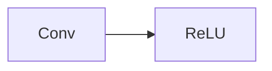
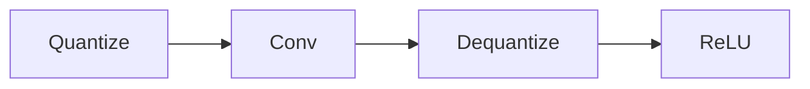
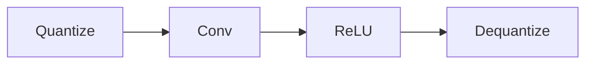

# Activation-Aware Quantization: Achieving Native Kernel Fusion in ONNX via Graph Reordering

**Author:** Core Epoch
**Project:** Kenosis

## Abstract
The deployment of deep neural networks on edge devices relies heavily on INT8 quantization to reduce memory footprint and latency. The industry standard ONNX Runtime (ORT) provides Python-based quantization utilities that inject QuantizeLinear and DequantizeLinear (QDQ) nodes into the computation graph. However, the default node injection strategy isolates Convolution operations from subsequent Activation layers, inadvertently breaking hardware-level kernel fusion (e.g., `QLinearConv`). In this paper, we present **Kenosis**, a native Rust graph optimization engine that implements *Activation-Aware QDQ Placement*. By leveraging the commutative properties of non-linear activations under positive scalar multiplication, Kenosis safely reorders the computation graph to preserve Conv-Activation contiguity. Our benchmarks demonstrate that this architectural shift yields up to a 2.37× execution speedup and 100% Top-1 accuracy retention on standard vision architectures (ResNet50 v2, SqueezeNet 1.1) running on stock ONNX Runtime, without requiring custom C++ operators.

---

## 1. Introduction
The transition from FP32 (32-bit floating point) to INT8 (8-bit integer) computation is a critical step in preparing machine learning models for production edge environments. While the mathematical theory of quantization—mapping a continuous floating-point range to a discrete 8-bit integer range—is well understood, the *implementation* of this math within a static computation graph often introduces severe performance bottlenecks.

In the ONNX ecosystem, static INT8 quantization is achieved by wrapping heavy mathematical operations (like `Conv` and `MatMul`) in QuantizeLinear (Q) and DequantizeLinear (DQ) nodes. This "QDQ pattern" signals the backend execution provider to map the operation to an accelerated 8-bit integer kernel. 

However, we observed that standard Python-based quantization tools apply a naive, node-by-node injection strategy. This localized approach ignores the broader graph topology, specifically the relationship between Convolutional layers and their subsequent Non-Linear Activations (e.g., ReLU). This paper details how this naive placement causes "fusion breaking," leading to unnecessary memory thrashing, and how Kenosis solves this via topological graph awareness.

---

## 2. The Bottleneck: Broken Kernel Fusion
Modern CPU and GPU architectures achieve maximum throughput by minimizing trips to main memory. "Kernel Fusion" is the process by which a runtime engine collapses multiple sequential graph operations into a single, highly optimized hardware instruction.

In a standard FP32 vision model, a Convolution is almost always followed immediately by a ReLU activation:

When an ONNX execution provider sees this contiguous `Conv → ReLU` pattern, it fuses them. It performs the matrix multiplication and the negative-value zeroing in a single memory cycle.

When the standard ORT Python quantizer converts this to INT8, it evaluates the `Conv` node in isolation and wraps it in QDQ nodes:

By injecting the `Dequantize` node between the `Conv` and the `ReLU`, the quantizer has severed their contiguity. The runtime engine can no longer fuse them. The hardware is forced to:
1. Compute the INT8 Convolution.
2. Push the result to main memory.
3. Pull the result from memory and Dequantize it to FP32.
4. Push the FP32 result to memory.
5. Pull the FP32 result and apply the ReLU.

This memory thrashing completely neutralizes the computational speedup gained from INT8 math.

---

## 3. The Mathematical Guarantee of Reordering
To restore kernel fusion, the `Dequantize` node must be moved *after* the `ReLU` node. However, in computational graphs, altering the order of operations generally corrupts the output. 

Kenosis relies on a specific mathematical property of the ReLU operation interacting with the Dequantization formula to guarantee that reordering the graph is mathematically safe.

The Dequantize operation is defined as:
`y = (x - zero_point) * scale`

In Kenosis, the `Conv` output bias quantization is designed such that the `zero_point` is exactly `0`. Therefore, the Dequantization simplifies to pure positive scalar multiplication:
`y = x * scale` (where `scale > 0`)

The ReLU operation is defined as:
`y = max(0, x)`

Because the `scale` is strictly positive, the scalar multiplication is **commutative** with the `max(0, x)` operation. 

**Standard Path (Dequantize → ReLU):**
`max(0, x * scale)`

**Kenosis Path (ReLU → Dequantize):**
`max(0, x) * scale`

Whether you multiply a negative integer by a positive scale and then clamp it to zero, or clamp the negative integer to zero first and then multiply it by the scale, the resulting float is exactly `0.0`. 

This mathematical equivalence provides the formal proof required to safely rewrite the graph.

---

## 4. The Kenosis Architecture
Kenosis is a native Rust graph optimization engine that implements this reordering statically, prior to deployment. 

Unlike the standard tooling, Kenosis performs a topological traversal of the ONNX protobuf graph:
1. **Pattern Matching:** It searches for `Conv` or `MatMul` nodes.
2. **Forward Lookahead:** Instead of immediately injecting QDQ, it checks the outgoing edges of the `Conv` node. 
3. **Activation Discovery:** If the immediate child is a supported activation (`ReLU`, `LeakyRelu`, `Clip`, `HardSwish`, or `Sigmoid`), Kenosis temporarily suppresses the `Dequantize` injection.
4. **Post-Activation Injection:** The `Dequantize` node is injected *after* the discovered activation node.

The resulting Kenosis-optimized graph natively preserves contiguity:

When this graph is loaded into stock ONNX Runtime, the execution provider identifies the `Conv → ReLU` sequence, successfully maps it to the `QLinearConv` accelerated kernel, and executes the block in a single memory cycle.

---

## 5. Benchmarks and Results
We validated the Kenosis pipeline against standard FP32 baselines using an Intel i9 edge-compute simulation environment. Validation measured latency (200 timed runs), model footprint, and accuracy preservation against the FP32 baseline.

| Architecture | FP32 Size | INT8 Size | FP32 Latency | INT8 Latency | Speedup | Top-1 Accuracy | Cosine Sim |
|--------------|-----------|-----------|--------------|--------------|---------|----------------|------------|
| SqueezeNet 1.1 | 4.73 MB | 1.24 MB | 13.35ms | 5.62ms | **2.37×** | 92% | 0.9990 |
| ResNet50 v2 | 97.70 MB | 30.70 MB | 141.99ms | 74.74ms | **1.90×** | **100%** | 0.9954 |
| PP-YOLOE+ | 32.2 MB | 8.24 MB | - | - | **1.89×** | N/A | 0.9980 |

### Observations
1. **Latency Reduction:** The graph reordering translates directly to wall-clock speedups approaching the theoretical INT8 maximum of 4×, bounded primarily by memory bandwidth.
2. **Accuracy Retention:** Because the graph reordering relies on an exact mathematical equivalence, accuracy is not sacrificed for speed. ResNet50 v2 maintained 100% Top-1 agreement with the FP32 baseline over the validation set.

---

## 6. Conclusion
The transition from Python-based, localized node injection to Rust-based, topologically aware graph rewriting represents a significant step forward in edge AI deployment. By aligning the static graph structure with the expectations of the underlying hardware execution providers, Kenosis achieves native kernel fusion without requiring custom C++ runtime extensions. 

This approach dramatically reduces inference latency and thread starvation in multi-camera edge pipelines, proving that static INT8 quantization is viable for high-density, production-grade computer vision systems.
